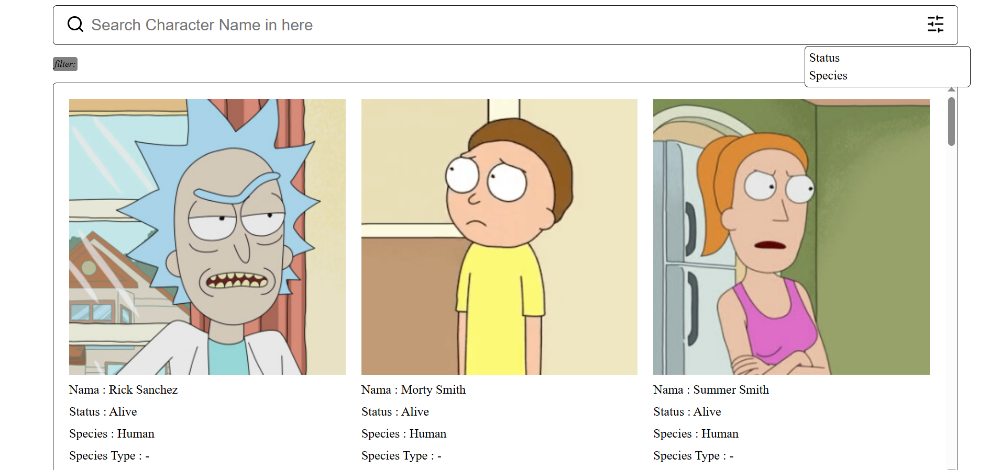

# Project DOM Fetch Data

This project is for training only. This project implement CSS Display Grid and DOM Fetch Data to make a list of characters in Rick and Morty Animated Series.

## Preview



## How to Run this Project

1. Clone this project
```
git clone https://github.com/mdavindarinaldy/fgo24-dom-fetching.git
```
3. Run the project

## Dependencies
This project don't have any dependency.

## Basic Information
This project is part of training in Kodacademy Bootcamp Batch 24 made by Muhammad Davinda Rinaldy